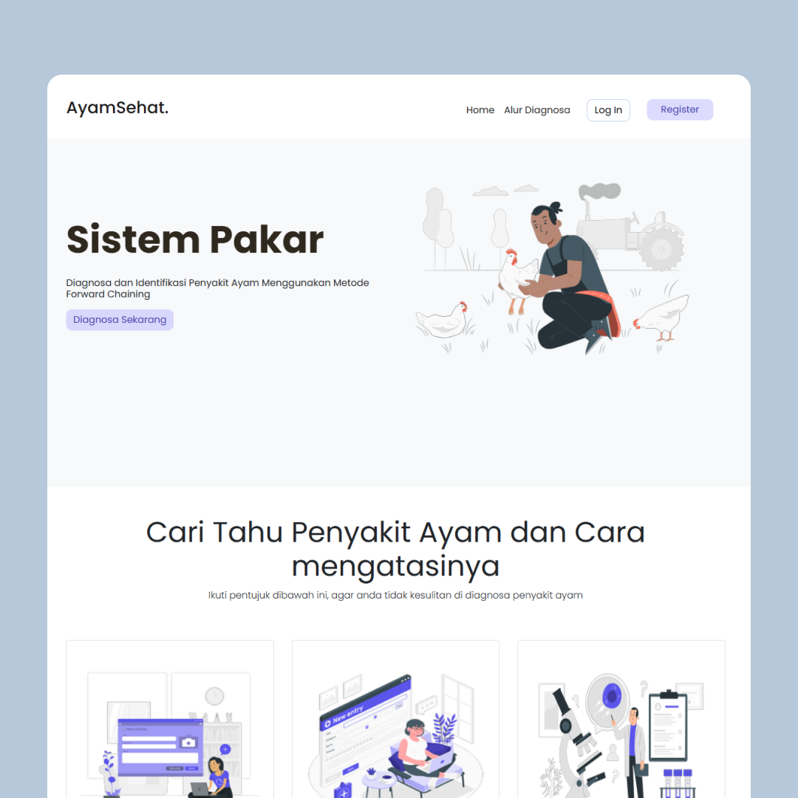
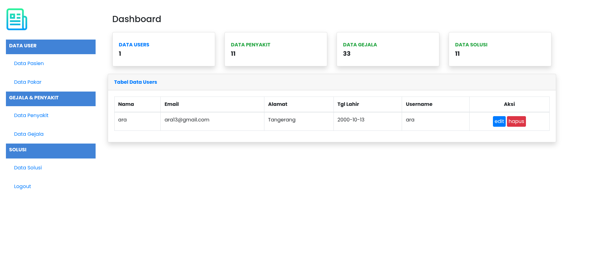
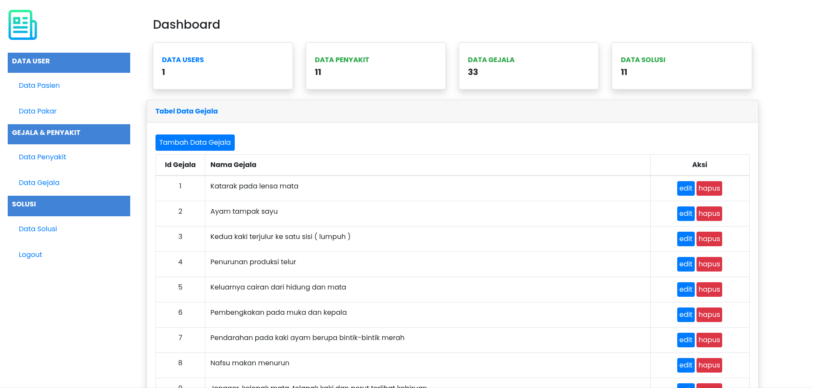
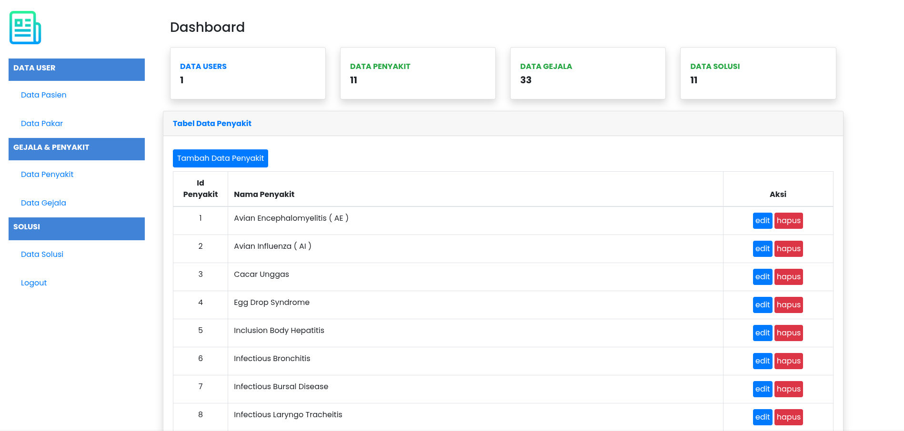
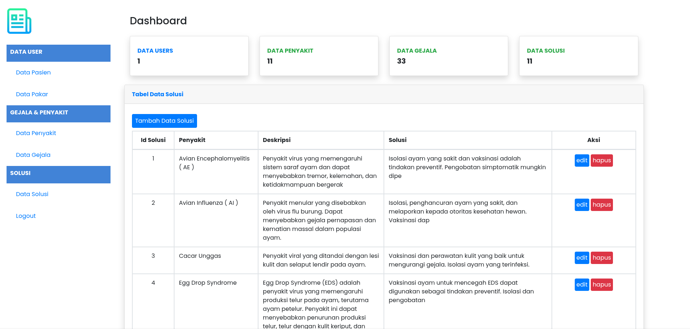
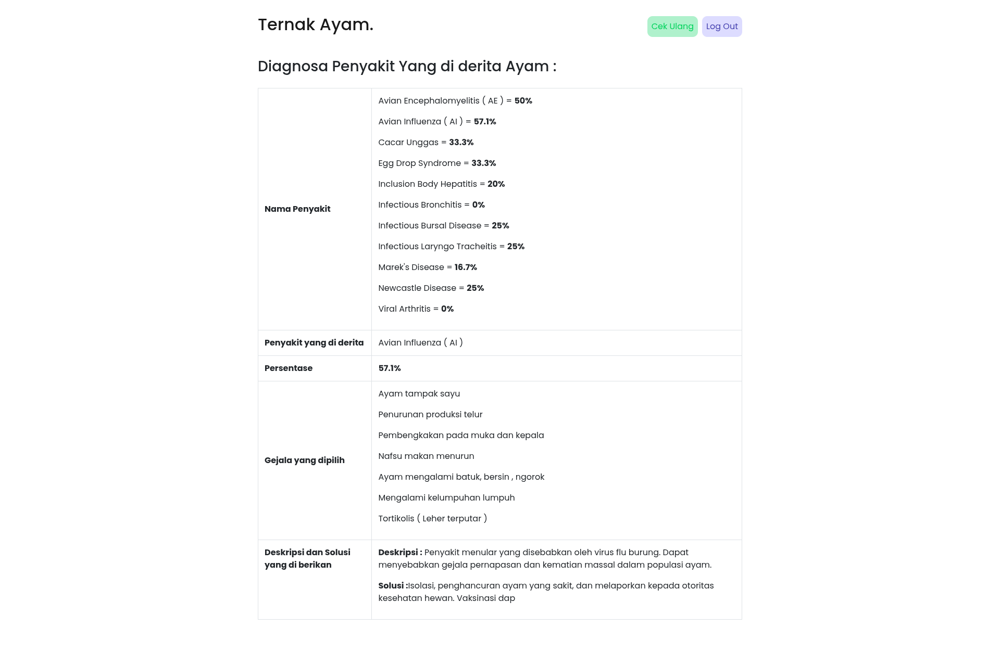

# Sistem Pakar Diagnosa Penyakit Ayam

  

## 📖 Tentang

Penyakit ayam merupakan salah satu permasalahan yang sering dihadapi oleh peternak ayam. Untuk mendiagnosis penyakit ayam, peternak perlu mengenali gejala-gejala yang muncul pada ayam dan berkonsultasi dengan ahlinya. Namun, hal tersebut membutuhkan waktu dan biaya yang cukup besar.

Proyek ini bertujuan untuk mengembangkan **sistem pakar berbasis web** yang dapat membantu peternak mendiagnosis penyakit ayam secara cepat dan mudah. Sistem ini menggunakan metode **Forward Chaining** untuk menentukan penyakit ayam berdasarkan gejala yang diinput oleh pengguna. Sistem ini dikembangkan dengan bahasa pemrograman **PHP** dan basis data **MySQL**, serta didukung oleh tampilan antarmuka **Bootstrap**.

Sistem ini menyediakan panduan penanganan yang tepat terhadap penyakit yang didiagnosis, dan diuji menggunakan **33 gejala** dan **10 jenis penyakit** ayam yang umum terjadi. Hasil pengujian menunjukkan bahwa sistem dapat mendiagnosis penyakit ayam dengan akurasi tinggi dan memberikan hasil diagnosis secara langsung melalui browser.

(<a href="#top">back to top</a>)

---

## Demo App

  <figure>
    
    <figcaption>---Halaman Dashboard---</figcaption>
  </figure>
  
  <figure>
  
    <figcaption>---Halaman Gejala---</figcaption>
  </figure>
  
  <figure>
  
    <figcaption>---Halaman Penyakit---</figcaption>
  </figure>
  
  <figure>
  
    <figcaption>---Halaman Solusi---</figcaption>
  </figure>

  <figure>
  
    <figcaption>---Halaman Result---</figcaption>
  </figure>

---

## 🛠️ Teknologi yang Digunakan

- **PHP** - Web development
- **Bootstrap** - Responsive design
- **MySQL** - Database management

## Konfigurasi

#### Dummy User

- Username = ara
- Password = 12345678

#### Admin

- Username = admin
- Password = 12345678

## 🚀 Features
- [x] **Diagnosa**

  - [x] Tambah Gejala
  - [x] Tambah Penyakit
  - [x] Tambah Solusi
  - [x] Edit Gejala
  - [x] Edit Penyakit
  - [x] Edit Solusi
  
- [x] **Authentication**

  - [x] Register
  - [x] Login
  - [x] Logout
  - [x] Reset Password

- [ ] **User Management**

  - [x] View Profile
  - [ ] Edit Profile
  - [ ] Delete Account

- [ ] **Dashboard**

  - [x] User Dashboard
  - [x] Admin Dashboard
  - [ ] Statistics Overview

- [x] **Responsive Design**
  - [ ] Mobile-Friendly Layout
  - [ ] Tablet-Friendly Layout
  - [x] Desktop Layout

## 🔗 Link Pendukung

- **Documentasi API** - Tautan ke documentasi API
- **Database Diagram** - Tautan ke diagram database

## 👤 Kontribusi

Kontribusi untuk pengembangan lebih lanjut sangat terbuka! Berikut cara Anda dapat berkontribusi:

- Fork repositori ini.
- Buat branch fitur baru (`git checkout -b fitur-anda`).
- Commit perubahan Anda (`git commit -m 'Menambahkan fitur ABC'`).
- Push ke branch (`git push origin fitur-anda`).
- Ajukan Pull Request.

## ❤️ Dukungan dan Donasi

Jika Anda merasa sistem ini bermanfaat dan ingin mendukung pengembangan lebih lanjut, Anda dapat memberikan donasi melalui platform berikut:

-  [Klik di sini](https://saweria.co/AhmadJanuar)
-  [Klik di sini](https://paypal.me/ahmadjanuar)
-   
  **Nomor HP**: 089630507889 
  **Atas Nama**: Ahmad Januar Amri

Setiap dukungan yang Anda berikan akan sangat membantu untuk pengembangan proyek ini lebih lanjut. Terima kasih atas dukungannya! 😊
****

(<a href="#readme-top">back to top</a>)

