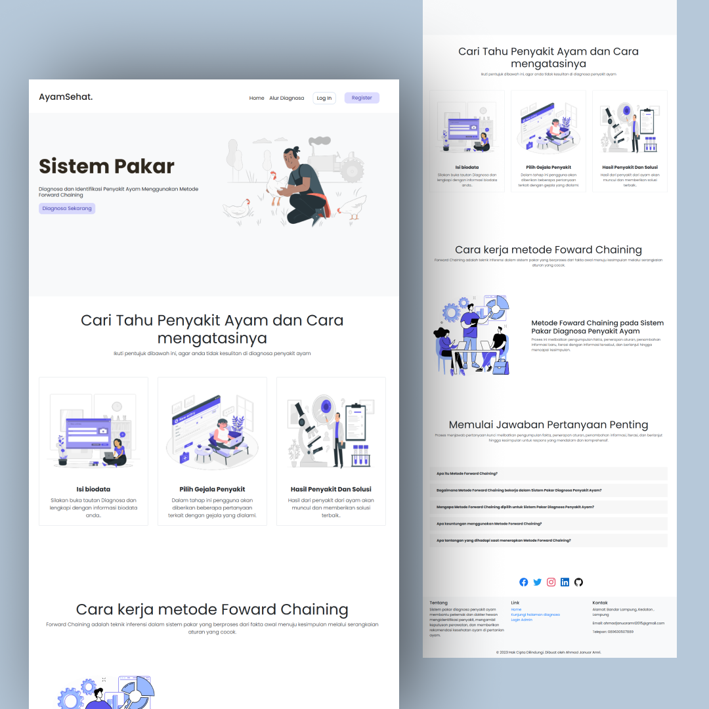

## About The Project

  

Chicken disease is one of the problems often faced by chicken farmers. To diagnose
chicken disease, farmers need to recognize the symptoms that appear in chickens and consult with experts.
However, this requires quite a lot of time and money.

Therefore, this research aims to developing a web-based expert system that can help farmers in diagnosing chicken diseases
quickly and easily. This expert system uses the Forward Chaining method to determine chicken diseases
based on symptoms entered by the user.

This expert system was developed using language PHP programming and MySQL database. This expert system also provides appropriate handling guidance
diagnosed disease. This expert system was tested using 33 symptoms and 10 common chicken diseases
happen. The test results show that this expert system can diagnose chicken diseases with high accuracy
high and provides diagnosis results directly via a web browser. This expert system can also
improve user understanding of website creation and chicken diseases.

(<a href="#readme-top">back to top</a>)

### Built With

- PHP
- Bootstrap
- MySql

(<a href="#readme-top">back to top</a>)

